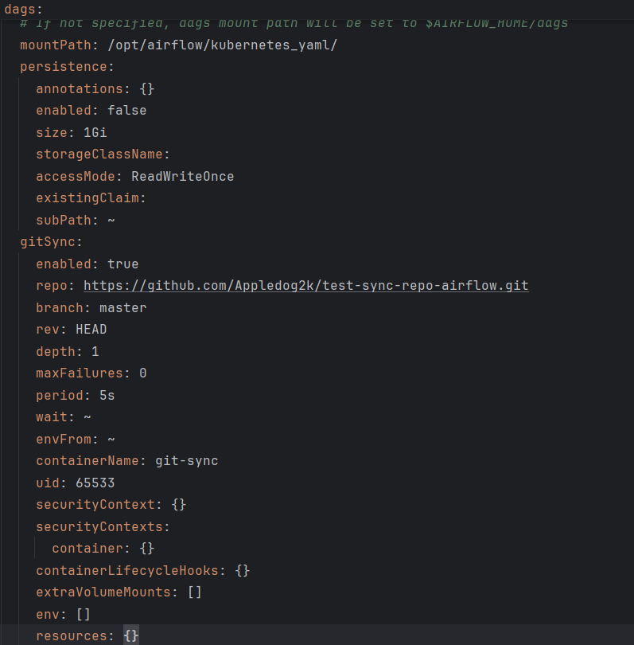
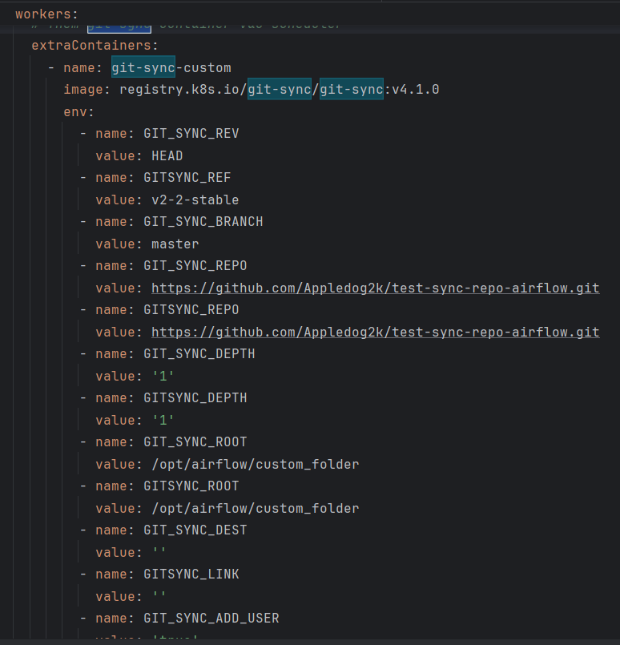
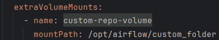

### Hướng dẫn sử dụng multi git-sync trong Airflow

#### Mục đích
    - Hướng dẫn cấu hình sử dụng nhiều git-sync trong Airflow
##### Cài đặt Airflow với helm
    Bước 1: Install Airflow with helm
        helm repo add apache-airflow https://airflow.apache.org
        helm upgrade --install airflow apache-airflow/airflow --namespace airflow --create-namespace
    
    Bước 2: Extract configuration from the running Airflow
        helm show values apache-airflow/airflow > values.yaml

    Bước 3: Update configuration
        - Cấu hình đồng bộ repo code với git-sync mặc định của airflo

        _**Code sẽ được đồng bộ từ Repo test vào thư mục /opt/airflow/kubernetes_yaml/ trong airflow server**_

    Bước 4: Thêm cấu hình git-sync mới
        - Dừng lại 1 chút, theo mặc định thì airflow thiết kế mặc định 1 git-sync để đồng bộ code từ repo về airflow server, nhưng nếu chúng ta muốn đồng bộ từ nhiều repo khác nhau thì sao?
        - Cần hiểu 1 chút để cấu hình:
            + Airflow server là nói chung thực ra nó bao gồm 1 tập hợp các service:
                ++ Webserver: Service để quản lý giao diện web
                ++ Worker: Service để chạy các task
                ++ Scheduler: Service để quản lý các task
                ++ Trigger: Service để quản lý trigger
                ++ Postgres: Service để quản lý database, metadata
                ++ Redis: Đóng vai trò queue, phân phối task
                ++ Statsd 
            + Vậy những service nào sẽ sử dụng git-sync (nói đúng hơn những service nào chứa code) thì cần cấu hình git-sync
                ++ Worker
                ++ Trigger
                ++ Scheduler
            + Cơ bản có 3 service trên sẽ sử dụng git-sync, vậy để thực hiện được mục tiêu ban đầu cần cấu hình để git-sync mới có thể đồng bộ code vào những service này
                ++ Nhắc lại 1 chút về k8s: Trong k8s pod chứa các container điều này quan trọng.
                ++ Như đã nhắc ở trên chúng ta cần cấu hình sao cho các pod service Worker, Trigger, Scheduler có chứa container git-sync mà chúng ta tự custom.
                ++ Rất may là helm chart của airflow đã hỗ trợ chúng ta cấu hình thêm container cho các service này.

                ++ Đừng quên tạo volumns

                ++ Mọi người xem chi tết tại source code

    Bước 5: Apply configuration
        helm upgrade --install airflow apache-airflow/airflow --namespace airflow --create-namespace -f values.yaml